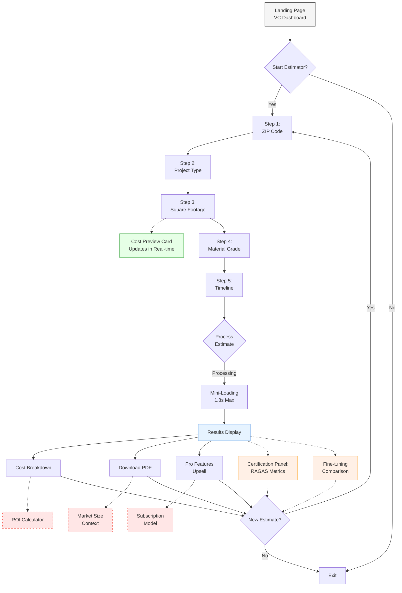

# User Flow Diagram
**AI Remodel & Home Extension Cost Predictor 6-Hour MVP**

## Flow Description

This flowchart illustrates the streamlined user journey for the 6-Hour MVP, optimized for both certification compliance and VC impressions.

### Key Components:

1. **Entry Point with VC Dashboard**
   - Prominently displays market metrics and performance indicators
   - Immediate start button to begin the estimation process

2. **5-Step Express Form**
   - Simplified input collection with real-time cost preview
   - Each step designed for minimum input friction
   - Progressive disclosure of complexity

3. **Results With Triple Focus**
   - User value: Detailed cost breakdown
   - Certification requirements: RAGAS metrics and fine-tuning comparison
   - VC appeal: Market context and subscription upsell

4. **Real-Time Elements**
   - Cost preview updates continuously as inputs change
   - Minimal loading time (max 1.8s) for processing
   - Instant PDF generation

### Special Features:

- **Certification-Specific Components** (orange nodes)
  - RAGAS metrics panel showing all required measurements
  - Fine-tuning comparison demonstrating embedding improvements
  - These sections can be expanded for evaluators but minimized for regular users

- **VC-Focused Elements** (red dashed nodes)
  - ROI calculator showing value proposition
  - Market size context highlighting opportunity
  - Subscription model preview showing growth potential

This user flow is specifically designed to complete certification requirements with minimal development time while creating an impression of a mature, market-ready product for potential investors.